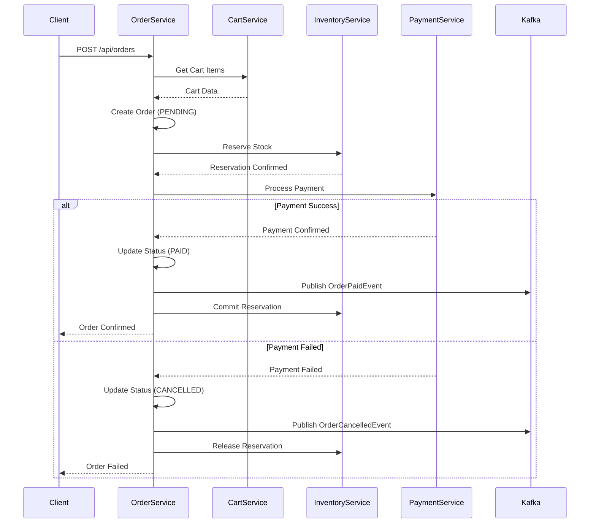

# Order Service Implementation Plan
## Spring Boot Microservices E-Commerce Platform

### **📋 Executive Summary**

Based on analysis of Gemini's comprehensive plan and our existing architecture, this document outlines the complete implementation strategy for the **ecom-order-service**. The plan prioritizes seamless integration with our existing services while following established patterns from inventory-service and cart-service.

---

## **🎯 Implementation Strategy**

### **Phase-Based Development Approach**
1. **Foundation & Database** → Core entities and schema
2. **Service Integration** → Cart and inventory integration  
3. **Event-Driven Architecture** → Kafka event handling
4. **Advanced Features** → Admin endpoints and order management

---

## **🗄️ Database Design & Schema**

### **Schema: `order_service`**
Following our existing multi-schema approach with proper isolation.

#### **Core Entities**

```sql
-- orders table
CREATE TABLE order_service.orders (
    id UUID PRIMARY KEY DEFAULT gen_random_uuid(),
    order_number VARCHAR(50) UNIQUE NOT NULL, -- Business friendly ID
    user_id VARCHAR(255) NOT NULL,           -- From JWT token
    session_id VARCHAR(255),                 -- For guest orders
    cart_id VARCHAR(255),                    -- Reference to original cart
    
    -- Financial data
    total_amount DECIMAL(10,2) NOT NULL,
    tax_amount DECIMAL(10,2) DEFAULT 0,
    shipping_amount DECIMAL(10,2) DEFAULT 0,
    discount_amount DECIMAL(10,2) DEFAULT 0,
    
    -- Status and lifecycle
    order_status VARCHAR(50) NOT NULL DEFAULT 'PENDING',
    payment_status VARCHAR(50) DEFAULT 'PENDING',
    fulfillment_status VARCHAR(50) DEFAULT 'PENDING',
    
    -- Customer information (snapshot at order time)
    customer_email VARCHAR(255),
    customer_name VARCHAR(255),
    billing_address JSONB,
    shipping_address JSONB,
    
    -- System fields
    version BIGINT DEFAULT 0,                -- Optimistic locking
    created_at TIMESTAMP DEFAULT NOW(),
    updated_at TIMESTAMP DEFAULT NOW(),
    
    -- Indexes
    INDEX idx_orders_user_id (user_id),
    INDEX idx_orders_status (order_status),
    INDEX idx_orders_created_at (created_at DESC),
    INDEX idx_orders_order_number (order_number)
);

-- order_items table
CREATE TABLE order_service.order_items (
    id UUID PRIMARY KEY DEFAULT gen_random_uuid(),
    order_id UUID NOT NULL REFERENCES order_service.orders(id) ON DELETE CASCADE,
    
    -- Product information (snapshot at order time)
    product_id BIGINT NOT NULL,
    product_name VARCHAR(500) NOT NULL,
    product_sku VARCHAR(100),
    product_image_url TEXT,
    
    -- Pricing and quantity
    quantity INTEGER NOT NULL CHECK (quantity > 0),
    unit_price DECIMAL(10,2) NOT NULL,
    total_price DECIMAL(10,2) NOT NULL,
    
    -- System fields
    created_at TIMESTAMP DEFAULT NOW(),
    
    -- Indexes
    INDEX idx_order_items_order_id (order_id),
    INDEX idx_order_items_product_id (product_id)
);

-- order_status_history table (audit trail)
CREATE TABLE order_service.order_status_history (
    id UUID PRIMARY KEY DEFAULT gen_random_uuid(),
    order_id UUID NOT NULL REFERENCES order_service.orders(id) ON DELETE CASCADE,
    
    previous_status VARCHAR(50),
    new_status VARCHAR(50) NOT NULL,
    status_type VARCHAR(50) NOT NULL, -- ORDER, PAYMENT, FULFILLMENT
    
    comment TEXT,
    changed_by VARCHAR(255), -- User ID or SYSTEM
    reason VARCHAR(255),
    
    created_at TIMESTAMP DEFAULT NOW(),
    
    INDEX idx_order_status_history_order_id (order_id),
    INDEX idx_order_status_history_created_at (created_at DESC)
);

-- order_events table (event sourcing support)
CREATE TABLE order_service.order_events (
    id UUID PRIMARY KEY DEFAULT gen_random_uuid(),
    order_id UUID NOT NULL REFERENCES order_service.orders(id) ON DELETE CASCADE,
    
    event_type VARCHAR(100) NOT NULL,
    event_data JSONB,
    correlation_id VARCHAR(255),
    
    created_at TIMESTAMP DEFAULT NOW(),
    
    INDEX idx_order_events_order_id (order_id),
    INDEX idx_order_events_type (event_type),
    INDEX idx_order_events_created_at (created_at DESC)
);
```

### **Liquibase Migration Strategy**
```yaml
# src/main/resources/db/changelog/db.changelog-master.yaml
databaseChangeLog:
  - include:
      file: db/changelog/001-initial-schema.yaml
  - include:
      file: db/changelog/002-order-indexes.yaml
  - include:
      file: db/changelog/003-order-constraints.yaml
```

---

## **🏗️ Service Architecture**

### **Package Structure**
```
com.amar.orderservice/
├── config/
│   ├── DatabaseConfig.java
│   ├── KafkaConfig.java  
│   ├── WebClientConfig.java
│   └── CircuitBreakerConfig.java
├── controller/
│   ├── OrderController.java
│   └── AdminOrderController.java
├── dto/
│   ├── request/
│   │   ├── CreateOrderRequest.java
│   │   ├── UpdateOrderStatusRequest.java
│   │   └── OrderSearchRequest.java
│   ├── response/
│   │   ├── OrderResponse.java
│   │   ├── OrderSummaryResponse.java
│   │   └── OrderHistoryResponse.java
│   └── OrderItemDto.java
├── entity/
│   ├── Order.java
│   ├── OrderItem.java
│   ├── OrderStatusHistory.java
│   └── OrderEvent.java
├── enums/
│   ├── OrderStatus.java
│   ├── PaymentStatus.java
│   └── FulfillmentStatus.java
├── event/
│   ├── OrderEventPublisher.java
│   └── OrderEventListener.java
├── exception/
│   ├── OrderNotFoundException.java
│   ├── InvalidOrderStateException.java
│   └── OrderServiceException.java
├── repository/
│   ├── OrderRepository.java
│   ├── OrderItemRepository.java
│   └── OrderStatusHistoryRepository.java
├── service/
│   ├── OrderService.java
│   ├── CartIntegrationService.java
│   ├── InventoryIntegrationService.java
│   ├── PaymentIntegrationService.java
│   └── OrderSagaOrchestrator.java
└── saga/
    ├── OrderSaga.java
    ├── SagaStep.java
    └── CompensationAction.java
```

---

## **📊 Business Logic Flow**

### **Order Creation Saga Pattern**



---

## **🔌 API Design**

### **Customer Endpoints**

#### **Create Order**
```http
POST /api/v1/orders
Authorization: Bearer {jwt-token}
Content-Type: application/json

{
  "cartId": "cart:anon:session-uuid-123",
  "shippingAddress": {
    "street": "123 Main St",
    "city": "Portland", 
    "state": "OR",
    "zipCode": "97201",
    "country": "US"
  },
  "billingAddress": { /* same structure */ },
  "paymentMethod": {
    "type": "CREDIT_CARD",
    "token": "stripe-payment-method-token"
  }
}
```

**Response:**
```json
{
  "success": true,
  "data": {
    "orderId": "550e8400-e29b-41d4-a716-446655440000",
    "orderNumber": "ORD-2025-000001", 
    "status": "PENDING",
    "totalAmount": "299.99",
    "items": [
      {
        "productId": 12345,
        "productName": "Wireless Headphones",
        "quantity": 2,
        "unitPrice": "149.99",
        "totalPrice": "299.98"
      }
    ],
    "createdAt": "2025-08-31T18:00:00Z"
  },
  "message": "Order created successfully"
}
```

#### **Get Order Details**
```http
GET /api/v1/orders/{orderId}
Authorization: Bearer {jwt-token}
```

#### **Get User Order History**  
```http
GET /api/v1/orders?page=0&size=10&status=PAID&sortBy=createdAt&sortDir=DESC
Authorization: Bearer {jwt-token}
```

### **Admin Endpoints**

#### **Get All Orders (Admin)**
```http
GET /api/v1/admin/orders?page=0&size=20&userId=user123&status=PENDING
Authorization: Bearer {admin-jwt-token}
```

#### **Update Order Status (Admin)**
```http
PUT /api/v1/admin/orders/{orderId}/status
Authorization: Bearer {admin-jwt-token}

{
  "status": "SHIPPED",
  "comment": "Shipped via FedEx",
  "trackingNumber": "1234567890"
}
```

---

## **⚡ Integration Patterns**

### **1. Cart Service Integration**

```java
@Service
public class CartIntegrationService {
    
    @Autowired
    private WebClient.Builder webClientBuilder;
    
    @CircuitBreaker(name = "cart-service")
    @Retry(name = "cart-service")
    public CartDto getCartForOrder(String cartId, String userId) {
        return webClientBuilder
            .baseUrl("http://cart-service")
            .build()
            .get()
            .uri("/api/v1/cart/for-order?cartId={cartId}", cartId)
            .header("X-User-Id", userId)
            .retrieve()
            .bodyToMono(CartDto.class)
            .timeout(Duration.ofSeconds(5))
            .block();
    }
    
    @CircuitBreaker(name = "cart-service")
    public void clearCartAfterOrder(String cartId, String userId) {
        webClientBuilder
            .baseUrl("http://cart-service")
            .build()
            .delete()
            .uri("/api/v1/cart/clear")
            .header("X-User-Id", userId)
            .header("X-Cart-Id", cartId)
            .retrieve()
            .bodyToMono(Void.class)
            .timeout(Duration.ofSeconds(5))
            .block();
    }
}
```

### **2. Inventory Service Integration**

```java
@Service  
public class InventoryIntegrationService {
    
    @CircuitBreaker(name = "inventory-service")
    public boolean reserveOrderStock(UUID orderId, List<OrderItem> items, String userId) {
        StockReservationRequest request = new StockReservationRequest(
            orderId, 
            items.stream().map(this::toReservationItem).collect(toList()),
            userId
        );
        
        return webClientBuilder
            .baseUrl("http://inventory-service")  
            .build()
            .post()
            .uri("/api/v1/inventory/reserve")
            .bodyValue(request)
            .retrieve()
            .bodyToMono(StockReservationResponse.class)
            .map(response -> response.getSuccess())
            .timeout(Duration.ofSeconds(10))
            .block();
    }
}
```

### **3. Event Publishing Integration**

```java
@Service
public class OrderEventPublisher {
    
    public void publishOrderCreated(Order order) {
        OrderCreatedEvent event = new OrderCreatedEvent(
            order.getId(),
            order.getUserId(),
            order.getItems().stream()
                .map(item -> new OrderItem(item.getProductId(), item.getQuantity()))
                .collect(toList()),
            order.getTotalAmount().toString(),
            order.getOrderStatus().name()
        );
        
        kafkaTemplate.send("order-events", order.getId().toString(), event);
    }
    
    public void publishOrderPaid(Order order, String paymentId) {
        OrderPaidEvent event = new OrderPaidEvent(
            order.getId(),
            order.getUserId(), 
            paymentId,
            order.getTotalAmount().toString()
        );
        
        kafkaTemplate.send("order-events", order.getId().toString(), event);
    }
}
```

---

## **🔄 Saga Implementation**

### **OrderSagaOrchestrator**

```java
@Service
@Transactional
public class OrderSagaOrchestrator {
    
    public void orchestrateOrderCreation(CreateOrderRequest request, String userId) {
        OrderSaga saga = new OrderSaga(request, userId);
        
        try {
            // Step 1: Create pending order
            Order order = saga.createPendingOrder();
            
            // Step 2: Reserve inventory
            boolean stockReserved = saga.reserveInventory(order);
            if (!stockReserved) {
                saga.compensateOrderCreation(order);
                throw new OrderCreationException("Failed to reserve inventory");
            }
            
            // Step 3: Process payment
            PaymentResult paymentResult = saga.processPayment(order);
            if (!paymentResult.isSuccess()) {
                saga.compensateInventoryReservation(order);
                saga.compensateOrderCreation(order);
                throw new PaymentFailedException("Payment processing failed");
            }
            
            // Step 4: Finalize order
            saga.finalizeOrder(order, paymentResult);
            
        } catch (Exception ex) {
            saga.executeCompensations();
            throw new OrderSagaException("Order creation saga failed", ex);
        }
    }
}
```

---

## **📈 Performance & Scalability**

### **Caching Strategy**
```java
@Cacheable(value = "orders", key = "#orderId")
public OrderResponse getOrderById(UUID orderId) {
    // Cached for 15 minutes
}

@Cacheable(value = "user-orders", key = "#userId + '_' + #pageable.pageNumber")  
public Page<OrderSummaryResponse> getUserOrders(String userId, Pageable pageable) {
    // Cached for 5 minutes
}
```

### **Database Optimization**
- Proper indexing on frequently queried fields
- Read replicas for order history queries
- Partitioning by date for large order volumes
- Connection pooling configuration

### **Async Processing**
```java
@Async("orderTaskExecutor")
public void processOrderConfirmationNotification(UUID orderId) {
    // Send confirmation emails, update external systems
}

@EventListener
@Async("orderTaskExecutor") 
public void handleOrderStatusChange(OrderStatusChangedEvent event) {
    // Update search indexes, trigger notifications
}
```

---

## **🎯 Implementation Phases**

### **Phase 1: Foundation (Week 1)**
- [ ] **Database Setup**: Liquibase migrations, entity creation
- [ ] **Core Entities**: Order, OrderItem, OrderStatusHistory JPA entities
- [ ] **Repositories**: Spring Data repositories with custom queries
- [ ] **Basic Order Service**: Create order in PENDING status
- [ ] **Order Controller**: POST /api/v1/orders endpoint
- [ ] **Unit Tests**: Service layer testing

### **Phase 2: Service Integration (Week 2)**  
- [ ] **WebClient Configuration**: Circuit breakers, timeouts
- [ ] **Cart Integration**: Fetch cart data for order creation
- [ ] **Inventory Integration**: Stock reservation API calls
- [ ] **Order Status Management**: Status transition logic
- [ ] **Event Publishing**: Kafka event publishers
- [ ] **Integration Tests**: Testcontainers with PostgreSQL

### **Phase 3: Saga & Payment (Week 3)**
- [ ] **Payment Service Client**: External payment integration
- [ ] **Saga Orchestrator**: Order creation workflow
- [ ] **Compensation Logic**: Rollback mechanisms
- [ ] **Order Lifecycle Events**: Complete event publishing
- [ ] **Error Handling**: Comprehensive exception handling
- [ ] **End-to-End Tests**: Full order workflow testing

### **Phase 4: Advanced Features (Week 4)**
- [ ] **Admin Endpoints**: Order management APIs
- [ ] **Order History**: User order queries with pagination
- [ ] **Search & Filtering**: Advanced order search capabilities  
- [ ] **Order Tracking**: Status tracking and notifications
- [ ] **Performance Optimization**: Caching, query tuning
- [ ] **Load Testing**: Performance validation

---

## **🧪 Testing Strategy**

### **Unit Tests (JUnit 5 + Mockito)**
```java
@ExtendWith(MockitoExtension.class)
class OrderServiceTest {
    
    @Mock
    private OrderRepository orderRepository;
    
    @Mock
    private CartIntegrationService cartIntegrationService;
    
    @InjectMocks
    private OrderService orderService;
    
    @Test
    void createOrder_ValidCart_ReturnsOrderResponse() {
        // Test order creation logic
    }
}
```

### **Integration Tests (Testcontainers)**
```java
@SpringBootTest
@TestMethodOrder(OrderAnnotation.class)
class OrderServiceIntegrationTest {
    
    @Container
    static PostgreSQLContainer<?> postgres = new PostgreSQLContainer<>("postgres:15")
            .withDatabaseName("testdb")
            .withUsername("test")
            .withPassword("test");
    
    @Test
    @Order(1)
    void createOrder_WithRealDatabase_Success() {
        // Full integration test with real database
    }
}
```

### **Contract Testing (Spring Cloud Contract)**
```groovy
// contracts/order_creation_contract.groovy
Contract.make {
    description "should create order from valid cart"
    request {
        method POST()
        url "/api/v1/orders"
        body([
            cartId: "cart:anon:test-session-123"
        ])
        headers {
            contentType(applicationJson())
            header("Authorization", "Bearer valid-jwt-token")
        }
    }
    response {
        status OK()
        body([
            success: true,
            data: [
                orderId: anyUuid(),
                orderNumber: $(regex(/ORD-\d{4}-\d{6}/)),
                status: "PENDING"
            ]
        ])
        headers {
            contentType(applicationJson())
        }
    }
}
```

---

## **⚠️ Risk Mitigation**

### **Common Challenges & Solutions**

| Challenge | Impact | Solution |
|-----------|--------|----------|
| **Distributed Transaction Failures** | High | Saga pattern with compensation logic |
| **Service Dependencies** | Medium | Circuit breakers, fallback strategies |  
| **Data Consistency** | High | Event sourcing, eventual consistency |
| **Performance Bottlenecks** | Medium | Caching, async processing, read replicas |
| **Payment Integration** | High | Retry mechanisms, idempotent operations |
| **Order Status Conflicts** | Medium | Optimistic locking, version control |

### **Monitoring & Observability**
```java
// Micrometer metrics
@Timed(name = "order.creation.time", description = "Order creation duration")
@Counted(name = "order.creation.count", description = "Order creation count")
public OrderResponse createOrder(CreateOrderRequest request, String userId) {
    // Implementation with metrics
}

// Distributed tracing
@NewSpan("order-creation")
public void createOrder(@SpanTag("userId") String userId) {
    // Automatically traced across services
}
```

---

## **🚀 Production Readiness**

### **Configuration Management**
```yaml
# application-prod.yml
order:
  payment:
    timeout: 30s
    retries: 3
  inventory:
    reservation-timeout: 60s
  saga:
    max-retries: 5
    compensation-timeout: 120s

spring:
  datasource:
    hikari:
      maximum-pool-size: 20
      minimum-idle: 5
      connection-timeout: 30000
```

### **Security Configuration**
```java
@Configuration
@EnableWebSecurity
public class OrderSecurityConfig {
    
    @Bean
    public SecurityFilterChain filterChain(HttpSecurity http) throws Exception {
        http.oauth2ResourceServer(oauth2 -> oauth2
            .jwt(jwt -> jwt.jwtAuthenticationConverter(jwtConverter())))
            .authorizeHttpRequests(auth -> auth
                .requestMatchers("/api/v1/admin/**").hasRole("ADMIN")
                .requestMatchers("/api/v1/orders/**").authenticated()
                .anyRequest().permitAll());
        return http.build();
    }
}
```

---

## **📋 Success Metrics**

### **Technical KPIs**
- Order creation time < 500ms (95th percentile)
- Payment processing success rate > 99.5%
- Service availability > 99.9% uptime
- Database query performance < 50ms average

### **Business KPIs**
- Order abandonment rate < 5%
- Payment failure rate < 2%
- Customer order completion time < 3 minutes
- Order accuracy rate > 99.8%

---

## **🎯 Conclusion**

This comprehensive plan provides a production-ready implementation strategy for the ecom-order-service that seamlessly integrates with our existing microservices ecosystem. The phased approach ensures controlled development while the Saga pattern provides robust distributed transaction handling.

**Key Differentiators:**
- **Seamless Integration**: Leverages existing patterns from inventory and cart services
- **Event-Driven Architecture**: Full Kafka integration for decoupled communication  
- **Production Ready**: Comprehensive error handling, monitoring, and security
- **Scalable Design**: Optimized for high-volume order processing
- **Testable Architecture**: Complete testing strategy from unit to end-to-end

Ready for immediate implementation with clear milestones and deliverables.